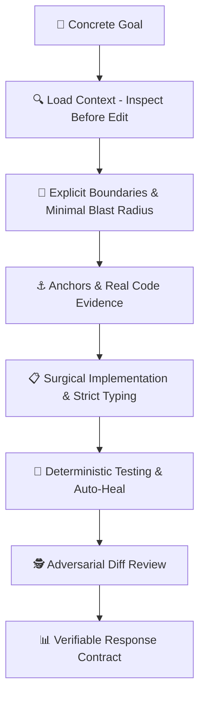

<div align="center">

# 🛡️ CLEARER Engineering Harness (CEH)
### Evidence-Driven Software Engineering Framework for Google Antigravity

[](https://opensource.org/licenses/Apache-2.0)
[](https://github.com/nandinhos/antigravity-clearer-engineering-harness)
[-brightgreen.svg)](./clearer-engineering/tests/)
[](#-the-risk-dial--execution-autonomy)

[**Português (Brasil)**](./README_PT.md) | **English**

</div>

---

## 📖 Overview

The **CLEARER Engineering Harness (CEH)** is a production-grade software engineering harness natively engineered for **Google Antigravity** (IDE and `agy` CLI).

Rather than relying on vague prompts or unverified model assumptions, CEH operates under the highest standards of **Staff Software Engineering**:
- **Continuous Execution for MEDIUM Risk**: The complete `INSPECT → PLAN → IMPLEMENT → TEST → REVIEW → AUDIT` cycle is conducted end-to-end in a **Single-Turn**, eliminating artificial stops and unnecessary micro-handoffs.
- **High-Level Craftsmanship**: Strict typing, Clean Code/SOLID, defensive architecture (explicit handling of nulls, timeouts, and exceptions), and deterministic behavioral tests.
- **Management by Exception**: Strict checkpoints that only halt execution when facing real business ambiguities, destructive commands in the Safety Gate, persistent test failures, or explicit `HIGH RISK` tasks.
- **Zero Hallucination & Zero Fake Pass**: Prohibits speculative code creation and guarantees every claim is backed by real execution logs and exit codes.



---

## ⚡ Global One-Line Installation

Install or update CEH across Linux, macOS, or WSL with a single command:

```bash
curl -fsSL https://raw.githubusercontent.com/nandinhos/antigravity-clearer-engineering-harness/main/install.sh | bash
```

### Manual Installation

```bash
# Clone the repository
git clone https://github.com/nandinhos/antigravity-clearer-engineering-harness.git
cd antigravity-clearer-engineering-harness

# Run the installer
chmod +x install.sh
./install.sh
```

---

## 🚀 Quick Usage

Reload your shell with `source ~/.bashrc` (or `source ~/.zshrc`), then:

```bash
# Start Antigravity with the CLEARER Engineering Harness profile
agy-ceh

# Or start in YOLO mode (continuous end-to-end execution with active Safety Gate)
agy-ceh-yolo

# Quick alias
ceh
```

> **In Antigravity IDE**: Global rules, skills, and hooks from CEH are loaded automatically across all workspace sessions.

---

## 📚 Complete Technical Documentation (`docs/`)

Deep dive into CEH principles, architectures, and guidelines:

| Document | Description |
|---|---|
| 📜 [**CLEARER Protocol Guide**](./docs/clearer_protocol.md) | Complete explanation of the 7-step engineering cycle (*Concrete Goal*, *Load Context*, etc.). |
| 💎 [**Coding Standards & Craftsmanship**](./docs/coding_standards.md) | Staff engineering standards: Clean Code, SOLID, strict typing, resilience, and tests. |
| 🎚️ [**Risk Dial Specification**](./docs/risk_dial.md) | **Continuous Execution** dynamics for MEDIUM and the 4 exception checkpoint gates. |
| ⚖️ [**Evidence Semantics & Claims**](./docs/evidence_semantics.md) | Epistemic classification (`OBSERVED`, `INFERRED`, `UNKNOWN`) and claim auditing (`SUPPORTED`). |
| 🏗️ [**System Architecture**](./docs/architecture.md) | Unified pipelines, topologies, data contracts, and Antigravity hook integration. |
| 🤖 [**Specialized Agents Guide**](./docs/agents_guide.md) | Role descriptions and I/O contracts for Investigator, Architect, Implementer, Test Engineer, Reviewer, and Auditor. |
| 🛠️ [**Skills & Commands Manual**](./docs/skills_and_commands.md) | How to use `/clearer`, `/clearer-feature`, `/clearer-bugfix`, `/clearer-refactor`, etc. |
| 🛡️ [**Safety Gate Guide**](./docs/safety_gate.md) | How `PreToolUse` hooks intercept destructive commands with `DENY > ASK > ALLOW`. |
| 💻 [**Installation & Troubleshooting**](./docs/installation.md) | Global installation, environment prerequisites, and uninstallation. |
| 💡 [**Practical Examples**](./docs/examples.md) | Real-world workflows across TypeScript, PHP/Laravel, and Python/FastAPI. |

---

## 🧠 The 7-Step CLEARER Protocol

| Step | Principle | Description |
|---|---|---|
| **C** | **Concrete Goal** | Define precise requirements, acceptance criteria, boundaries, and stop conditions. |
| **L** | **Load Context** | *Inspect before edit*. Detect stack, locate entrypoints, tests, and dependencies. Never guess. |
| **E** | **Explicit Boundaries** | Confine blast radius. State what is in-scope, out-of-scope, and invariant contracts. |
| **A** | **Anchors & Examples** | Ground every decision in real code, schemas, migrations, and existing patterns. |
| **R** | **Response Contract** | Emit structured, auditable outputs (Changes, Evidence, Tests, Review, Confidence). |
| **E** | **Enable Evidence & Tools** | Direct observation over speculation. Capture raw command outputs and exit codes. |
| **R** | **Review & Validate** | Run the complete verification loop: `INSPECT → PLAN → IMPLEMENT → TEST → REVIEW → AUDIT`. |

---

## 🎚️ The Risk Dial & Execution Autonomy

| Level | Suitable Tasks | Operational Dynamic |
|---|---|---|
| **`LOW`** | Read-only queries, formatting, simple symbol renames, local documentation. | Fast execution, lean context, zero unnecessary overhead. |
| **`MEDIUM`** | Features, bug fixes, refactorings, API endpoints, business logic. | **Single-Turn Continuous Execution**: Inspect → Plan → High-Standard Implement → Tests with Auto-Heal → Diff Audit → Response Contract. |
| **`HIGH`** | Core auth, permissions, payments, concurrency, destructive migrations, production scripts. | Deep Investigation → Specialized Subagents → Adversarial Review → Formal Audit → Human Checkpoint. |

---

## 🛡️ Exception Checkpoints (Fail-Closed on Real Hazards)

The continuous agent stream is only halted upon encountering **4 strict exception conditions**:
1. **Real Business Ambiguity**: Mutually exclusive architectural/business decisions lacking specification.
2. **Destructive Risk (Safety Gate)**: Commands intercepted as `DENY` or `ASK` in `safety-gate.py` (`rm -rf /`, `DROP DATABASE`, `migrate:fresh`, etc.).
3. **Persistent Test Failure**: Test suite failing after 1 evidence-grounded auto-heal iteration.
4. **Explicit HIGH Level**: Tasks formally classified as high risk.

---

## 🧪 Automated Testing & Verification

```bash
# 1. Run Component & Integration Suite (19 tests)
./clearer-engineering/tests/run-all-tests.sh

# 2. Run Adversarial Verification Suite (5 cases)
./clearer-engineering/tests/run-adversarial-tests.sh
```

---

## 📄 License

Distributed under the **Apache License 2.0**. See [`LICENSE`](./LICENSE) for details.

