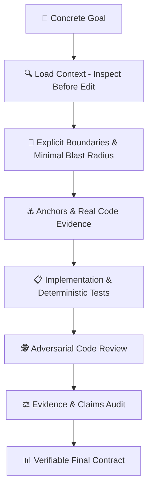
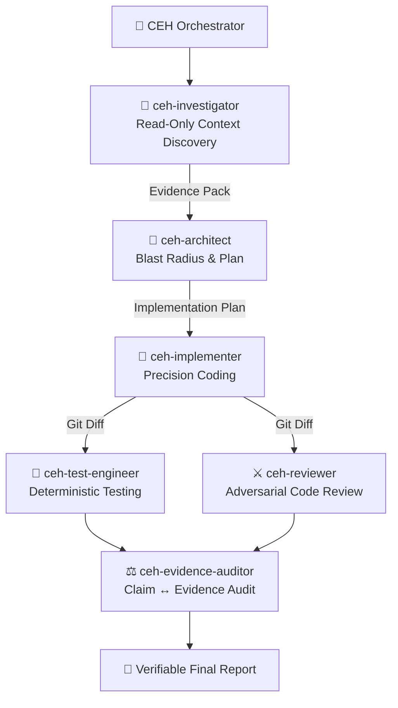

<div align="center">

# 🛡️ CLEARER Engineering Harness (CEH)
### Evidence-Driven Software Engineering Framework for Google Antigravity

[](https://opensource.org/licenses/Apache-2.0)
[](https://github.com/nandinhos/antigravity-clearer-engineering-harness)
[](./clearer-engineering/tests/)
[](#-the-risk-dial)

[**Português (Brasil)**](./README_PT.md) | **English**

</div>

---

## 📖 Overview

The **CLEARER Engineering Harness (CEH)** is a production-grade software engineering harness natively engineered for **Google Antigravity**. 

Rather than relying on vague prompts or unverified model assumptions, CEH forces the agent to act as a **rigorous, evidence-driven software engineer**. It eliminates *hallucination coding*, bans *fake pass* test reporting, minimizes the blast radius of changes, and conducts independent adversarial code reviews before changes are finalized.



---

## ⚡ Global One-Line Installation

Install CEH across Linux, macOS, or WSL with a single command:

```bash
curl -fsSL https://raw.githubusercontent.com/nandinhos/antigravity-clearer-engineering-harness/main/install.sh | bash
```

### Manual Installation

```bash
# Clone the repository
git clone https://github.com/nandinhos/antigravity-clearer-engineering-harness.git
cd antigravity-clearer-engineering-harness

# Run the installer
chmod +x install.sh
./install.sh
```

---

## 🚀 Quick Usage

Reload your shell or run `source ~/.bashrc` (or `source ~/.zshrc`), then:

```bash
# Start Antigravity with the CLEARER Engineering Harness profile
agy-ceh

# Or start in auto-approved edit mode (with Safety Gate active)
agy-ceh-yolo
```

---

## 📚 Complete Technical Documentation (`docs/`)

Deep dive into CEH principles, architectures, and guidelines:

| Document | Description |
|---|---|
| 📜 [**CLEARER Protocol Guide**](./docs/clearer_protocol.md) | Complete explanation of the 7-step engineering cycle (*Concrete Goal*, *Load Context*, etc.). |
| 🎚️ [**Risk Dial Specification**](./docs/risk_dial.md) | How CEH modulates cognitive effort across **LOW**, **MEDIUM**, and **HIGH** risk levels. |
| ⚖️ [**Evidence Semantics & Claims**](./docs/evidence_semantics.md) | Epistemic classification (`OBSERVED`, `INFERRED`, `UNKNOWN`) and claim auditing (`SUPPORTED`). |
| 🏗️ [**System Architecture**](./docs/architecture.md) | Topologies, data contracts, and Antigravity hook integration. |
| 🤖 [**Specialized Agents Guide**](./docs/agents_guide.md) | Role descriptions and I/O contracts for Investigator, Architect, Implementer, Test Engineer, Reviewer, and Auditor. |
| 🛠️ [**Skills & Commands Manual**](./docs/skills_and_commands.md) | How to use `/clearer`, `/clearer-feature`, `/clearer-bugfix`, `/clearer-refactor`, etc. |
| 🛡️ [**Safety Gate Guide**](./docs/safety_gate.md) | How `PreToolUse` hooks intercept destructive commands with `DENY > ASK > ALLOW`. |
| 💻 [**Installation & Troubleshooting**](./docs/installation.md) | Global installation, environment prerequisites, and uninstallation. |
| 💡 [**Practical Examples**](./docs/examples.md) | Real-world workflows across TypeScript, PHP/Laravel, and Python/FastAPI. |

---

## 🧠 The 7-Step CLEARER Protocol

| Step | Principle | Description |
|---|---|---|
| **C** | **Concrete Goal** | Define precise requirements, acceptance criteria, boundaries, and stop conditions. |
| **L** | **Load Context** | *Inspect before edit*. Detect stack, locate entrypoints, tests, and dependencies. Never guess. |
| **E** | **Explicit Boundaries** | Confine blast radius. State what is in-scope, out-of-scope, and invariant contracts. |
| **A** | **Anchors & Examples** | Ground every decision in real code, schemas, migrations, and existing patterns. |
| **R** | **Response Contract** | Emit structured, auditable outputs (Changes, Evidence, Tests, Review, Confidence). |
| **E** | **Enable Evidence & Tools** | Direct observation over speculation. Capture raw command outputs and exit codes. |
| **R** | **Review & Validate** | Run the complete verification loop: `INSPECT → PLAN → IMPLEMENT → TEST → REVIEW → AUDIT`. |

---

## 🎚️ The Risk Dial

| Level | Suitable Tasks | Enforced Procedure |
|---|---|---|
| **`LOW`** | Read-only queries, formatting, simple symbol renames, local documentation. | Fast execution, lean context, zero unnecessary agent orchestration. |
| **`MEDIUM`** | Features, bug fixes, controlled refactorings, API endpoints, schema additions. | Inspect → Minimal Plan → Surgical Implement → Automated Tests → Diff Audit → Report. |
| **`HIGH`** | Auth, permissions, payments, concurrency, destructive migrations, production scripts. | Deep Investigation → Specialized Subagents → Red/Green Tests → Adversarial Review → Formal Audit. |

---

## 🤖 Specialized Agent Topology



---

## 🧪 Automated Testing & Verification

```bash
# 1. Run Component & Integration Suite (17 tests)
./clearer-engineering/tests/run-all-tests.sh

# 2. Run Adversarial Verification Suite (5 cases)
./clearer-engineering/tests/run-adversarial-tests.sh
```

---

## 📄 License

Distributed under the **Apache License 2.0**. See [`LICENSE`](./LICENSE) for details.
