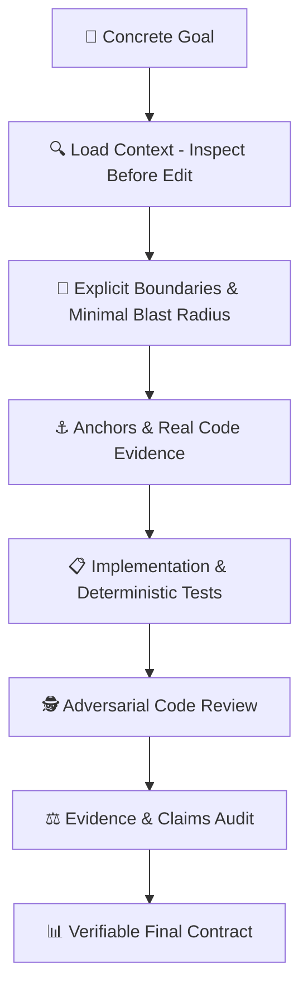
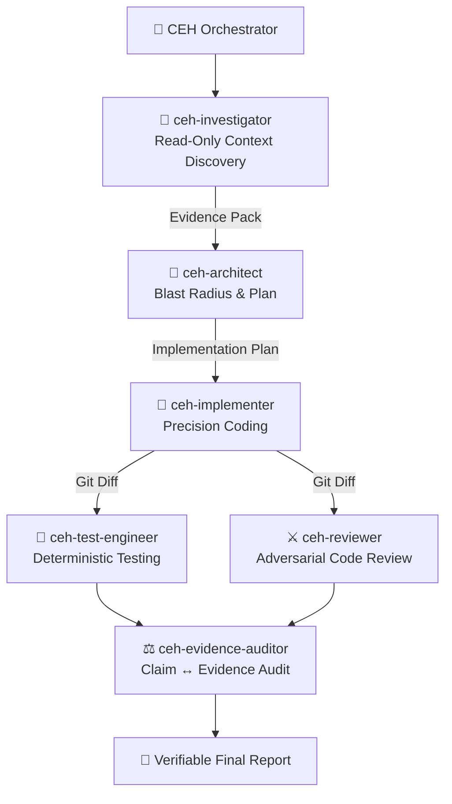

<div align="center">

# 🛡️ CLEARER Engineering Harness (CEH)
### Evidence-Driven Software Engineering Framework for Google Antigravity

[](https://opensource.org/licenses/Apache-2.0)
[](https://github.com/nandinhos/antigravity-clearer-engineering-harness)
[](./clearer-engineering/tests/)
[](#-the-risk-dial)

[**Português (Brasil)**](./README_PT.md) | **English**

</div>

---

## 📖 Overview

The **CLEARER Engineering Harness (CEH)** is a production-grade software engineering harness natively engineered for **Google Antigravity**. 

Rather than relying on vague prompts or unverified model assumptions, CEH forces the agent to act as a **rigorous, evidence-driven software engineer**. It eliminates *hallucination coding*, bans *fake pass* test reporting, minimizes the blast radius of changes, and conducts independent adversarial code reviews before changes are finalized.



---

## ⚡ Quick Start & Installation

### 1. Install via Antigravity CLI

```bash
# Clone the repository
git clone https://github.com/nandinhos/antigravity-clearer-engineering-harness.git
cd antigravity-clearer-engineering-harness

# Validate plugin manifest and assets
agy plugin validate ./clearer-engineering

# Install the plugin into Antigravity
agy plugin install ./clearer-engineering
```

### 2. Verify Available Harness Profiles

```bash
agy agent
```

Output:
```text
Available agents:
bc-harness
clearer-harness
gemini-orchestrator
```

### 3. Configure Shell Aliases (`~/.bashrc` / `~/.zshrc`)

```bash
# Run Antigravity with the CLEARER Engineering Harness profile
alias agy-ceh='agy --agent clearer-harness'

# Run in auto-approved edit mode with safety gate active
alias agy-ceh-yolo='agy --agent clearer-harness --dangerously-skip-permissions --mode accept-edits'
```

---

## 🧠 The 7-Step CLEARER Protocol

Every engineering task is strictly routed through the 7 CLEARER principles:

| Step | Principle | Description |
|---|---|---|
| **C** | **Concrete Goal** | Define precise requirements, acceptance criteria, boundaries, and stop conditions. |
| **L** | **Load Context** | *Inspect before edit*. Detect stack, locate entrypoints, tests, and dependencies. Never guess. |
| **E** | **Explicit Boundaries** | Confine blast radius. State what is in-scope, out-of-scope, and invariant contracts. |
| **A** | **Anchors & Examples** | Ground every decision in real code, schemas, migrations, and existing patterns. |
| **R** | **Response Contract** | Emit structured, auditable outputs (Changes, Evidence, Tests, Review, Confidence). |
| **E** | **Enable Evidence & Tools** | Direct observation over speculation. Capture raw command outputs and exit codes. |
| **R** | **Review & Validate** | Run the complete verification loop: `INSPECT → PLAN → IMPLEMENT → TEST → REVIEW → AUDIT`. |

---

## 🎚️ The Risk Dial

CEH automatically modulates cognitive overhead and agent chaining based on the **cost of failure**:

| Level | Suitable Tasks | Enforced Procedure |
|---|---|---|
| **`LOW`** | Read-only queries, formatting, simple symbol renames, local documentation. | Fast execution, lean context, zero unnecessary agent orchestration. |
| **`MEDIUM`** | Features, bug fixes, controlled refactorings, API endpoints, schema additions. | Inspect → Minimal Plan → Surgical Implement → Automated Tests → Diff Audit → Report. |
| **`HIGH`** | Auth, permissions, payments, concurrency, destructive migrations, production scripts. | Deep Investigation → Specialized Subagents → Red/Green Tests → Adversarial Review → Formal Audit. |

---

## 🤖 Specialized Agent Roles



---

## 🛠️ Built-in Skills & Slash Commands

| Command / Skill | Purpose |
|---|---|
| **`/clearer`** | Smart dispatcher: analyzes request intent, sets the Risk Dial, and routes execution. |
| **`/clearer-feature`** | Step-by-step feature workflow with blast radius calculation and test coverage. |
| **`/clearer-bugfix`** | **Root-Cause First** bug fixing: `Symptom → Reproduction → Hypothesis → Evidence → Root Cause → Red Test → Fix → Green Test`. |
| **`/clearer-refactor`** | Safe refactoring: captures baseline behavior, preserves API contracts, and audits diffs. |
| **`/clearer-review`** | Adversarial review of `git diff`, classifying findings as `BLOCKER`, `HIGH`, `MEDIUM`, `LOW`, `INFO`. |
| **`/clearer-audit`** | Final verification: audits all claims as `SUPPORTED`, `PARTIALLY_SUPPORTED`, or `UNSUPPORTED`. |
| **`/clearer-map`** | Read-only technical mapping of stack, entrypoints, schemas, and architecture. |
| **`/clearer-test`** | Runs test runners and captures deterministic evidence (COMMAND, EXIT CODE, PASS/FAIL). |

---

## 🔒 Safety Gate (`PreToolUse` Hook)

CEH includes an automated command interceptor in `scripts/safety-gate.py`:

- ⛔ **`DENY` (Hard Block)**: `rm -rf /`, `DROP DATABASE`, `mkfs`, `gcloud projects delete`, fork bombs.
- ⚠️ **`ASK` (Requires User Confirmation)**: `rm -rf <path>`, `git reset --hard`, `git clean -fdx`, `git push --force`, `migrate:fresh`, `db:wipe`, `terraform destroy`.
- ✅ **`ALLOW` (Automated Execution)**: Safe inspections, test suites (`npm test`, `pest`, `pytest`), linters, and compilers.

---

## 🧪 Validation & Test Suites

CEH includes a complete automated test harness:

```bash
# 1. Run Component & Integration Tests (17 tests)
./clearer-engineering/tests/run-all-tests.sh

# 2. Run Adversarial Suite (5 core test cases)
./clearer-engineering/tests/run-adversarial-tests.sh
```

### Adversarial Test Cases Verified:
1. **Investigate First**: Requesting code modifications without providing signatures forces read-only discovery first.
2. **Deterministic Test Verification**: Failing tests are captured as `FAIL` with raw exit codes (no *fake pass*).
3. **Regression Detection**: Unintended merge conflict markers or syntax regressions are flagged by the Diff Auditor.
4. **Anti-Hallucination Bound**: Non-existent classes or methods remain strictly `UNKNOWN` / `NOT FOUND`.
5. **Safety Gate Gating**: Destructive shell operations are caught and gated (`DENY` / `ASK`).

---

## 📄 License

Distributed under the **Apache License 2.0**. See [`LICENSE`](./LICENSE) for details.
