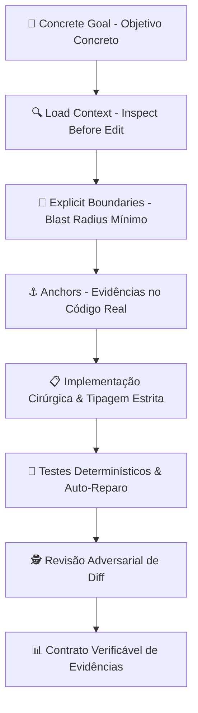

<div align="center">

# 🛡️ CLEARER Engineering Harness (CEH)
### Framework de Engenharia de Software Orientado a Evidências para o Google Antigravity

[](https://opensource.org/licenses/Apache-2.0)
[](https://github.com/nandinhos/antigravity-clearer-engineering-harness)
[-brightgreen.svg)](./clearer-engineering/tests/)
[](#-o-risk-dial)

**Português (Brasil)** | [**English**](./README.md)

</div>

---

## 📖 Visão Geral

O **CLEARER Engineering Harness (CEH)** é um framework de engenharia de software de alta precisão projetado nativamente para o **Google Antigravity** (IDE e `agy` CLI).

Em vez de depender de prompts vagos ou suposições não comprovadas, o CEH opera com os mais altos padrões de **Staff Software Engineering**:
- **Execução Contínua em Nível MEDIUM**: Ciclo completo `INSPECT → PLAN → IMPLEMENT → TEST → REVIEW → AUDIT` conduzido de ponta a ponta em **turno único (Single-Turn End-to-End)**, eliminando pausas artificiais e micro-handoffs desnecessários.
- **Craftsmanship de Alto Nível**: Tipagem estrita, Clean Code/SOLID, arquitetura defensiva (tratamento explícito de nulos, timeouts e exceções) e testes comportamentais determinísticos.
- **Gestão por Exceção**: Checkpoints estritos que só interrompem o fluxo diante de ambiguidades reais de negócio, comandos destrutivos no Safety Gate, falhas de testes persistentes ou tarefas expressamente `HIGH RISK`.
- **Zero Hallucination & Zero Fake Pass**: Proíbe a criação de código especulativo e garante que toda alegação de sucesso seja sustentada por comandos reais e logs executados.



---

## ⚡ Instalação Global em Um Comando (One-Liner)

Instale ou atualize o CEH no Linux, macOS ou WSL executando no terminal:

```bash
curl -fsSL https://raw.githubusercontent.com/nandinhos/antigravity-clearer-engineering-harness/main/install.sh | bash
```

### Instalação Manual

```bash
# Clonar o repositório
git clone https://github.com/nandinhos/antigravity-clearer-engineering-harness.git
cd antigravity-clearer-engineering-harness

# Executar o instalador
chmod +x install.sh
./install.sh
```

---

## 🚀 Como Utilizar

Após a instalação, recarregue o shell com `source ~/.bashrc` (ou `source ~/.zshrc`) e execute:

```bash
# Iniciar o Antigravity com o perfil CLEARER Engineering Harness
agy-ceh

# Iniciar em modo YOLO (execução contínua de ponta a ponta com Safety Gate ativo)
agy-ceh-yolo

# Atalho rápido
ceh
```

> **No Antigravity IDE**: As regras globais, skills e hooks do CEH são carregados automaticamente em todas as sessões e projetos.

---

## 📚 Documentação Técnica Completa (`docs/`)

Explore as diretrizes aprofundadas do CEH:

| Documento | Descrição |
|---|---|
| 📜 [**Guia do Protocolo CLEARER**](./docs/clearer_protocol.md) | Explicação completa das 7 etapas do ciclo de engenharia (*Concrete Goal*, *Load Context*, etc.). |
| 💎 [**Padrões de Código & Craftsmanship**](./docs/coding_standards.md) | Diretrizes de alto nível de engenharia: Clean Code, SOLID, tipagem estrita, resiliência e testes. |
| 🎚️ [**Especificação do Risk Dial**](./docs/risk_dial.md) | Dinâmica de **Execução Contínua** para MEDIUM e os 4 gates de checkpoint por exceção. |
| ⚖️ [**Semântica de Evidências & Claims**](./docs/evidence_semantics.md) | Classificação epistêmica (`OBSERVED`, `INFERRED`, `UNKNOWN`) e auditoria de claims (`SUPPORTED`). |
| 🏗️ [**Arquitetura do Sistema**](./docs/architecture.md) | Topologia, pipelines unificados, contratos entre subagentes e integração de hooks. |
| 🤖 [**Guia de Subagentes Especializados**](./docs/agents_guide.md) | Papéis de Investigator, Architect, Implementer, Test Engineer, Reviewer e Auditor. |
| 🛠️ [**Manual de Skills & Comandos**](./docs/skills_and_commands.md) | Como utilizar `/clearer`, `/clearer-feature`, `/clearer-bugfix`, `/clearer-refactor`, etc. |
| 🛡️ [**Guia do Safety Gate**](./docs/safety_gate.md) | Como o hook `PreToolUse` intercepta comandos destrutivos com `DENY > ASK > ALLOW`. |
| 💻 [**Instalação & Configuração**](./docs/installation.md) | Guia completo de instalação global, dependências e desinstalação. |
| 💡 [**Exemplos Práticos**](./docs/examples.md) | Casos reais de uso em TypeScript/Next.js, PHP/Laravel e Python/FastAPI. |

---

## 🧠 O Protocolo CLEARER em 7 Etapas

| Etapa | Princípio | Descrição |
|---|---|---|
| **C** | **Concrete Goal** | Definir requisitos precisos, critérios de aceite, escopo e condição de parada. |
| **L** | **Load Context** | *Inspect before edit*. Detectar a stack, entrypoints, testes e dependências antes de editar. |
| **E** | **Explicit Boundaries** | Delimitar o blast radius. Deixar explícito o que está dentro e o que fica fora do escopo. |
| **A** | **Anchors & Examples** | Fundamentar decisões no código existente, schemas, migrations e convenções do projeto. |
| **R** | **Response Contract** | Emitir saídas estruturadas e auditáveis (Alterações, Evidências, Testes, Review, Confiança). |
| **E** | **Enable Evidence & Tools** | Observação direta sobre suposição. Registrar saídas reais e exit codes das ferramentas. |
| **R** | **Review & Validate** | Executar o ciclo: `INSPECT → PLAN → IMPLEMENT → TEST → REVIEW → AUDIT`. |

---

## 🎚️ O Risk Dial & Automação de Execução

| Nível | Tarefas Indicadas | Dinâmica Operacional |
|---|---|---|
| **`LOW`** | Consultas, formatações, renomeações locais simples, extrações pontuais. | Execução rápida, contexto enxuto, zero sobrecarga. |
| **`MEDIUM`** | Features novas, correção de bugs, refatorações, endpoints, regras de negócio. | **Execução Contínua em Turno Único**: Inspeciona → Planeja → Implementa com Alto Padrão → Roda Testes com Auto-Reparo → Diff Audit → Response Contract. |
| **`HIGH`** | Autenticação core, permissões, pagamentos, concorrência, migrações destrutivas, segurança. | Investigação Profunda → Subagentes Especializados → Revisão Adversarial → Auditoria Estrita → Checkpoint Humano. |

---

## 🛡️ Checkpoints por Exceção (Fail-Closed on Real Hazards)

O fluxo contínuo do agente só é interrompido diante de **4 condições de parada estritas**:
1. **Ambiguidade Real de Negócio**: Decisões de arquitetura/negócio excludentes sem especificação clara.
2. **Risco Destrutivo (Safety Gate)**: Comandos interceptados como `DENY` ou `ASK` no `safety-gate.py` (`rm -rf /`, `DROP DATABASE`, `migrate:fresh`, etc.).
3. **Falha Persistente de Testes**: Quebra de suíte de testes após 1 iteração de auto-reparo fundamentada.
4. **Nível HIGH Explícito**: Tarefas classificadas expressamente como de alto risco.

---

## 🧪 Suíte de Testes Automatizada

```bash
# 1. Executar testes de integração e componentes (19 testes)
./clearer-engineering/tests/run-all-tests.sh

# 2. Executar suíte de testes adversariais (5 cenários)
./clearer-engineering/tests/run-adversarial-tests.sh
```

---

## 📄 Licença

Distribuído sob a licença **Apache License 2.0**. Consulte [`LICENSE`](./LICENSE) para mais detalhes.

