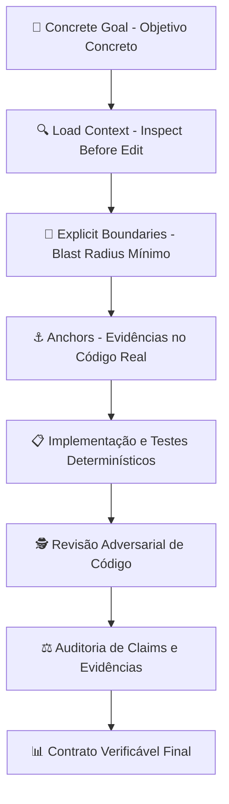
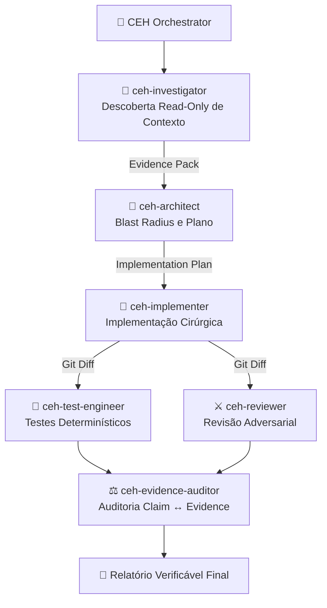

<div align="center">

# 🛡️ CLEARER Engineering Harness (CEH)
### Framework de Engenharia de Software Orientado a Evidências para o Google Antigravity

[](https://opensource.org/licenses/Apache-2.0)
[](https://github.com/nandinhos/antigravity-clearer-engineering-harness)
[](./clearer-engineering/tests/)
[](#-o-risk-dial)

**Português (Brasil)** | [**English**](./README.md)

</div>

---

## 📖 Visão Geral

O **CLEARER Engineering Harness (CEH)** é um framework de engenharia de software de alta precisão projetado nativamente para o **Google Antigravity**.

Em vez de depender de prompts vagos ou suposições não comprovadas, o CEH força o agente a trabalhar como um **engenheiro orientado a evidências**. Ele elimina o *hallucination coding*, proíbe relatórios falsos de testes (*fake pass*), minimiza o blast radius das modificações e executa revisões de código adversariais antes de consolidar qualquer entrega.



---

## ⚡ Instalação Rápida

### 1. Instalar via Antigravity CLI

```bash
# Clonar o repositório
git clone https://github.com/nandinhos/antigravity-clearer-engineering-harness.git
cd antigravity-clearer-engineering-harness

# Validar o manifesto e recursos do plugin
agy plugin validate ./clearer-engineering

# Instalar o plugin no Antigravity
agy plugin install ./clearer-engineering
```

### 2. Verificar Perfis de Agente Disponíveis

```bash
agy agent
```

Saída esperada:
```text
Available agents:
bc-harness
clearer-harness
gemini-orchestrator
```

### 3. Configurar Aliases no Shell (`~/.bashrc` ou `~/.zshrc`)

```bash
# Iniciar o Antigravity com o perfil do CLEARER Engineering Harness
alias agy-ceh='agy --agent clearer-harness'

# Iniciar em modo YOLO (auto-aprovação de edições com safety gate ativo)
alias agy-ceh-yolo='agy --agent clearer-harness --dangerously-skip-permissions --mode accept-edits'
```

---

## 🧠 O Protocolo CLEARER em 7 Etapas

Toda tarefa de engenharia segue rigorosamente as 7 diretrizes:

| Etapa | Princípio | Descrição |
|---|---|---|
| **C** | **Concrete Goal** | Definir requisitos precisos, critérios de aceite, escopo e condição de parada. |
| **L** | **Load Context** | *Inspect before edit*. Detectar a stack, entrypoints, testes e dependências antes de editar. |
| **E** | **Explicit Boundaries** | Delimitar o blast radius. Deixar explícito o que está dentro e o que fica fora do escopo. |
| **A** | **Anchors & Examples** | Fundamentar decisões no código existente, schemas, migrations e convenções do projeto. |
| **R** | **Response Contract** | Emitir saídas estruturadas e auditáveis (Alterações, Evidências, Testes, Review, Confiança). |
| **E** | **Enable Evidence & Tools** | Observação direta sobre suposição. Registrar saídas reais e exit codes das ferramentas. |
| **R** | **Review & Validate** | Executar o ciclo: `INSPECT → PLAN → IMPLEMENT → TEST → REVIEW → AUDIT`. |

---

## 🎚️ O Risk Dial

O CEH modula o esforço cognitivo e a sobrecarga de subagentes baseado no **custo do erro**:

| Nível | Tarefas Indicadas | Procedimento Obrigatório |
|---|---|---|
| **`LOW`** | Consultas, formatações, renomeações locais simples, extrações pontuais. | Execução rápida, contexto enxuto, zero sobrecarga de subagentes. |
| **`MEDIUM`** | Features novas, correção de bugs, refatorações controladas, endpoints, schemas. | Inspeção → Plano Conciso → Implementação Cirúrgica → Testes Reais → Diff Audit → Relatório. |
| **`HIGH`** | Autenticação, permissões, pagamentos, concorrência, migrações destrutivas, segurança. | Investigação Profunda → Subagentes Especializados → Testes Red/Green → Revisão Adversarial → Auditoria Estrita. |

---

## 🤖 Papéis dos Agentes Especializados



---

## 🛠️ Skills e Comandos Disponíveis

| Comando / Skill | Objetivo |
|---|---|
| **`/clearer`** | Dispatcher inteligente: analisa a solicitação, define o Risk Dial e seleciona o fluxo. |
| **`/clearer-feature`** | Workflow de ciclo completo para desenvolvimento de novas funcionalidades. |
| **`/clearer-bugfix`** | Correção de bug **Root-Cause First**: `Sintoma → Reprodução → Causa → Teste Red → Fix → Teste Green`. |
| **`/clearer-refactor`** | Refatoração segura: estabelece baseline, preserva contratos e audita o diff. |
| **`/clearer-review`** | Revisão adversarial do `git diff`, classificando achados em `BLOCKER`, `HIGH`, `MEDIUM`, `LOW`, `INFO`. |
| **`/clearer-audit`** | Auditoria formal de claims como `SUPPORTED`, `PARTIALLY_SUPPORTED` ou `UNSUPPORTED`. |
| **`/clearer-map`** | Mapeamento técnico read-only da arquitetura, stack, rotas e matriz de riscos. |
| **`/clearer-test`** | Execução determinística de testes e registro de evidências brutas (COMMAND, EXIT CODE, PASS/FAIL). |

---

## 🔒 Safety Gate (Hook `PreToolUse`)

O CEH inclui um interceptador de segurança em `scripts/safety-gate.py`:

- ⛔ **`DENY` (Bloqueio Total)**: `rm -rf /`, `DROP DATABASE`, `mkfs`, `gcloud projects delete`, fork bombs.
- ⚠️ **`ASK` (Requer Confirmação)**: `rm -rf <path>`, `git reset --hard`, `git clean -fdx`, `git push --force`, `migrate:fresh`, `db:wipe`, `terraform destroy`.
- ✅ **`ALLOW` (Execução Automática)**: Inspeções seguras, suítes de teste (`npm test`, `pest`, `pytest`), linters e compiladores.

---

## 🧪 Validação e Suítes de Teste

O harness possui duas suítes automatizadas completas:

```bash
# 1. Executar testes de integração e componentes (17 testes)
./clearer-engineering/tests/run-all-tests.sh

# 2. Executar suíte de testes adversariais (5 cenários do PRD)
./clearer-engineering/tests/run-adversarial-tests.sh
```

---

## 📄 Licença

Distribuído sob a licença **Apache License 2.0**. Consulte [`LICENSE`](./LICENSE) para mais detalhes.
