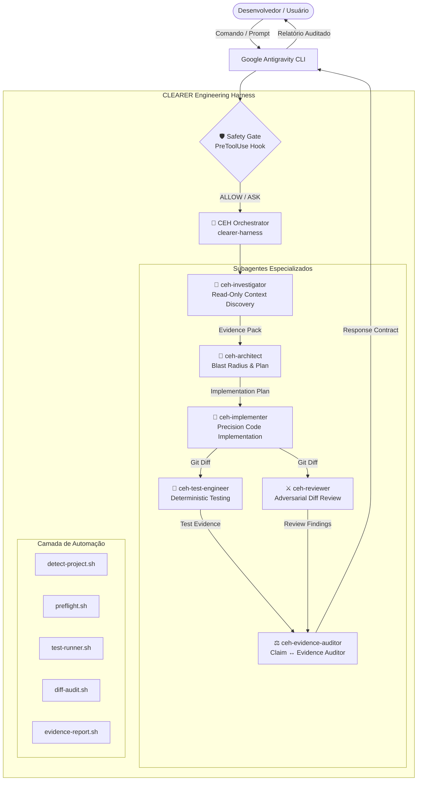

# Arquitetura Técnica do CEH

Este documento descreve a arquitetura interna do **CLEARER Engineering Harness (CEH)**, o fluxo de comunicação entre os agentes especializados e a integração nativa com o **Google Antigravity**.

---

## 1. Topologia Geral do Sistema



---

## 2. Fluxo de Dados e Contratos de Interface

### A. Evidence Pack (`Investigator → Architect`)
Artefato estruturado em YAML que resume os fatos observados sem alucinação:
```yaml
task:
  goal: "Objetivo concreto"
  risk_level: "MEDIUM"
observed:
  - "routes/api.php:24 - rota de login registrada"
inferred:
  - "O controller utiliza FormRequest para validação"
unknown:
  - "Nenhum rate limiter encontrado na rota"
relevant_files:
  - "app/Http/Controllers/AuthController.php"
contracts:
  - "POST /api/login -> 200 { token: string }"
tests:
  - "tests/Feature/AuthTest.php"
```

### B. Implementation Plan (`Architect → Implementer`)
Documento conciso delimitando o blast radius:
```text
1. Problema: Falta de validação de tentativas excessivas de login.
2. Objetivo Técnico: Adicionar throttle middleware com limite de 5 tentativas por minuto.
3. Arquivos Envolvidos: routes/api.php
4. Alterações Propostas: Adicionar ->middleware('throttle:5,1') na rota de login.
5. Contratos Preservados: Respostas 200 e 401 permanecem inalteradas.
6. Estratégia de Testes: Criar teste de 6 requisições consecutivas esperando 429 Too Many Requests.
```

### C. Findings de Revisão Adversarial (`Reviewer → Auditor`)
Classificação estruturada do Git diff:
```text
### [BLOCKER] Ausência de Rate Limiting
- Arquivo: routes/api.php:26
- Problema: Endpoint vulnerável a força bruta.
- Impacto: Possibilidade de ataque de enumeração de senhas.
- Correção: Inserir middleware de throttle configurado.
```

---

## 3. Integração com Hooks do Antigravity

O CEH se integra nativamente ao ciclo de vida do Antigravity através do `hooks.json`:

```json
{
  "ceh-safety-gate": {
    "enabled": true,
    "PreToolUse": [
      {
        "matcher": "run_command",
        "hooks": [
          {
            "type": "command",
            "command": "python3 scripts/safety-gate.py",
            "timeout": 15
          }
        ]
      }
    ]
  }
}
```

O `safety-gate.py` consome o payload JSON do `PreToolUse` via `stdin`, inspeciona o comando proposto e devolve a decisão imediata (`allow`, `ask` ou `deny`) via `stdout`.
