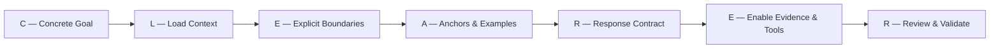

# Diretrizes: O Protocolo CLEARER

O **CLEARER Protocol** é o coração metodológico do *CLEARER Engineering Harness (CEH)*. Ele estabelece uma sequência obrigatória de raciocínio e execução técnica para transformar o agente em um engenheiro orientado a evidências.

---

## As 7 Etapas Fundamentais



---

## 1. C — Concrete Goal (Objetivo Concreto)

Antes de qualquer linha de código ou alteração no sistema, o engenheiro deve formalizar:

1. **Objetivo Técnico Específico**: O que exatamente o sistema deve realizar após a mudança?
2. **Critérios Objetivos de Aceite**: Declarações binárias verificáveis (`[x] O endpoint retorna 200 OK com payload JSON contendo o campo id`).
3. **Arquivos e Módulos Envolvidos**: Mapeamento preliminar do escopo de arquivos a serem tocados.
4. **Restrições e Invariantes**: Tecnologias que não podem ser adicionadas, APIs que não podem quebrar, requisitos de desempenho.
5. **Condição de Parada (Stop Condition)**: Definição clara de quando a tarefa está concluída.

> [!CRITICAL]
> **Resolução de Ambiguidade**: Se a solicitação contiver ambiguidades operacionais críticas (ex: regras de negócio indefinidas, tipos de dados desconhecidos), a implementação **NÃO** deve ser iniciada. Faça perguntas de alinhamento antes de codificar.

---

## 2. L — Load Context (Carregar Contexto com Inspeção Prévia)

> **Princípio Central**: *Inspect before edit*.

Nunca presuma a arquitetura, convenções ou dependências de um repositório sem consultar os arquivos reais:

1. **Stack Detection**: Identificar linguagem, versão, framework, gerenciador de pacotes e ferramentas de teste (`scripts/detect-project.sh`).
2. **Entrypoints**: Localizar onde a execução começa (`main.ts`, `index.php`, `app.py`, `routes/`, etc.).
3. **Código Relacionado**: Ler as classes, funções e modelos vizinhos para entender convenções de nomenclatura e tratamento de erros.
4. **Testes Existentes**: Encontrar os arquivos de teste que já cobrem a área afetada.
5. **Estado do Git**: Verificar `git status --short` para evitar sobrescrever trabalho em andamento do usuário.
6. **Contexto Enxuto**: Carregar apenas o contexto estritamente relevante para a tarefa corrente.

---

## 3. E — Explicit Boundaries (Fronteiras Explícitas & Blast Radius Mínimo)

Toda alteração deve buscar o **blast radius mínimo**:

- **Dentro do Escopo**: Apenas as mudanças necessárias para cumprir o Concrete Goal.
- **Fora do Escopo**: Refatorações oportunistas não solicitadas, reorganização de arquivos não relacionados, mudanças estéticas de formatação em módulos alheios.
- **Estabilidade de Contratos**: Interfaces públicas, assinaturas de métodos exportados, schemas de banco de dados e rotas HTTP existentes não devem sofrer breaking changes involuntárias.

---

## 4. A — Anchors and Examples (Âncoras & Código Real)

A única fonte da verdade é a evidência observável no repositório:

- Utilize como âncoras: código existente, testes unitários reais, schemas de banco, migrations, tipagens estáticas e documentação oficial da stack.
- Se uma inferência da IA entrar em conflito com o código real do repositório, **o código do repositório sempre prevalece**.

---

## 5. R — Response Contract (Contrato Auditável de Resposta)

Toda execução substancial deve produzir uma saída estruturada e verificável contendo:

```text
## RESULT
Status da execução (Implementado / Parcial / Bloqueado).

## CHANGES
Lista explícita de arquivos criados, editados ou excluídos.

## EVIDENCE
Comandos executados e observações diretas.

## TESTS
Registro formal com COMMAND, EXIT CODE e contagem de PASS / FAIL / NOT RUN.

## REVIEW
Achados da revisão adversarial (BLOCKER, HIGH, MEDIUM, LOW, INFO).

## ACCEPTANCE
Checklist de critérios de aceite confirmados com evidência.

## REMAINING RISKS
Riscos residuais ou itens fora de escopo identificados.

## CONFIDENCE
Nível de confiança fundamentado em evidências: HIGH | MEDIUM | LOW.
```

---

## 6. E — Enable Evidence and Tools (Evidências sobre Suposições)

- É expressamente proibido declarar que algo está *"corrigido"*, *"testado"* ou *"funcionando"* sem registrar o comando real e a saída obtida.
- Utilize ativamente as ferramentas de inspeção, linters, runners de teste (`scripts/test-runner.sh`) e visualizadores de diff (`scripts/diff-audit.sh`).

---

## 7. R — Review and Validate (Revisão Adversarial & Validação)

Escrever código não encerra uma tarefa. O ciclo completo deve ser seguido:

```text
INSPECT → PLAN → IMPLEMENT → TEST → ADVERSARIAL REVIEW → AUDIT → REPORT
```

1. **Testes Reais**: Executar a suíte automatizada.
2. **Revisão Adversarial**: Analisar o Git diff com a intenção ativa de encontrar falhas, vazamentos ou quebras de contrato.
3. **Auditoria de Claims**: Validar se todas as alegações feitas no relatório são suportadas por evidências concretas.
