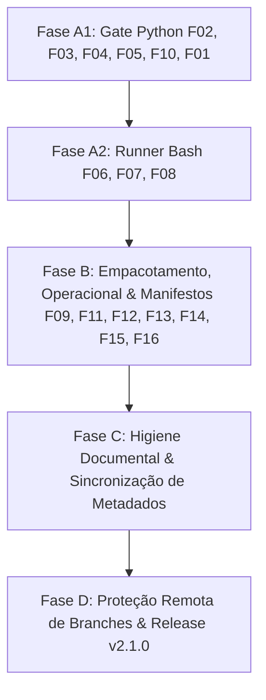

# Plano de Remediação da Auditoria Hermes (CEH v2.1.0)
## Pós-Deliberação do Conselho de Seniores (Plenária 6/6)

**Versão do Plano:** 1.1.0  
**Data:** 2026-10-01  
**Snapshot de Auditoria:** `b9a72b6b6dbd898dd737609bada8036866e56646`  
**Branch de Trabalho:** `dev-onda5-remediacao-hermes`  
**Referência da Auditoria:** [docs/audit/CEH-auditoria-e-evidencias-b9a72b6/analise-aprofundada.md](../audit/CEH-auditoria-e-evidencias-b9a72b6/analise-aprofundada.md)  
**Documento Arquitetural:** [docs/architecture/abstracao-remediacao-auditoria-hermes.md](./architecture/abstracao-remediacao-auditoria-hermes.md)  
**Ata do Conselho:** [docs/temp_implementation/conselho/20261001_auditoria_hermes/ata_conselho.md](./temp_implementation/conselho/20261001_auditoria_hermes/ata_conselho.md)  
**Veredito da Banca:** **HOMOLOGADO COM RESSALVAS**  

---

## 1. Princípios de Execução e Portões de Segurança (RFC 2119)

1. **MUST (TDD Red-Green)**: Todo achado (F01 a F16) deve ser precedido por um teste automatizado unitário/isolado que falhe comprovadamente (`RED`) antes do código ser alterado, seguido por teste negativo de controle (contra falsos positivos).
2. **MUST (Isolamento de Branches)**: Toda codificação ocorre estritamente na branch `dev-onda5-remediacao-hermes`. É terminantemente proibido commitar diretamente na branch `main`.
3. **MUST (Zero Regressão na Baseline da Onda 4)**: A cada fase concluída, o comando `python3 clearer-engineering/tests/tools/onda4_baseline.py --check` deve retornar 5/5 PASS.
4. **MUST (Preservação Canônica)**: A suíte de 75 testes existentes deve continuar passando integralmente (75/75 PASS).
5. **MUST (Auditoria Documental)**: `bash clearer-engineering/scripts/doc-audit.sh` deve manter 7/7 PASS.

---

## 2. Cronograma em 5 Fases Isoladas

A deliberação do Conselho subdividiu a Fase A em duas etapas independentes (Gate Python vs Runner Bash) para isolar blast radius e permitir reversão cirúrgica sem efeitos colaterais cruzados:

---

### Fase A1 — Gate de Avaliação Python (`ceh_core`) (Prioridade P1)
**Ordem cirúrgica:** Menor risco léxico primeiro; F01 por último.

1. **A1.1 (F02 — Monotonicidade de Ambiente no Desembrulho)**:
   - *RED*: `env APP_ENV=production bash -c 'php artisan migrate:fresh'` em fixture dev.
   - *Fix*: Passar ambiente externo como piso (`env_floor`) em `subcommand.py:154`, combinando com a detecção interna via `ENV_SEVERITY`.
   - *GREEN*: `deny` em produção; mantida detecção de repositório no `depth + 1`.
2. **A1.2 (F03 — Invocação Canônica de Git por Basename Exato)**:
   - *RED*: `/usr/bin/git push origin dev` sem certificado de CI.
   - *Fix*: Normalizar executável em `git_invocation.py` por `os.path.basename(tokens[0]) in ("git", "git.exe")` sem conversão minúscula arbitrária.
   - *GREEN*: `deny PRE_PUSH_CI` comprovado.
3. **A1.3 (F04 — Flags Estruturadas em Git Reset e Git Push)**:
   - *RED*: `git reset HEAD --hard` e `git push -vf origin dev`.
   - *Fix*: Consultar lista de argumentos do subcomando reset (`--hard`) e chave `"force"` de `parse_push_args` em `rules.py`.
   - *GREEN*: Classificação destrutiva invariante à ordem ou agrupamento de flags.
4. **A1.4 (F05 — Fail-Closed em Push Indireto sem Refspec)**:
   - *RED*: `git push origin` com `remote.origin.push = unchecked:dev`.
   - *Fix*: Se houver configuração não-canônica (`remote.<r>.push` ou `push.default != simple/current`), recusar com `FAIL_CLOSED`.
   - *GREEN*: Bloqueia envio de commits não certificados.
5. **A1.5 (F10 — Regra Sintática para `rm -r` em Diretórios Pontuados)**:
   - *RED*: `rm -rf customer.db` em produção.
   - *Fix*: Desabilitar atalho de arquivo único em `rm.py` se `-r` ou `-R` estiver presente na chamada. Sem `os.path.isdir`.
   - *GREEN*: Classificado estritamente como deleção recursiva destrutiva (`deny`).
6. **A1.6 (F01 — Integridade Cirúrgica em Redirecionamento)**:
   - *RED*: `cat f>.ceh/last-ci-run.json` e `bash -c 'echo' > .ceh/cert`.
   - *Fix*: Detecção cirúrgica em `is_cert_tampering` (`rules.py`): se houver menção a `.ceh/` e presença de `>` fora de aspas, classificar como G9.
   - *GREEN*: Bloqueio sem tocar no lexer global.

*Checkpoint Portão A1*: Rodar bateria de testes unitários + `onda4_baseline.py --check` (5/5 PASS).

---

### Fase A2 — Integridade do Runner de Testes (`test-runner.sh`) (Prioridade P1)

1. **A2.1 (F06 — Desmarcação de Suíte Canônica na Troca de Comando)**:
   - *RED*: Teste isolado simulando troca de comando para Sail.
   - *Fix*: Se `TEST_CMD` diferir de `CANONICAL_CMD`, marcar `CANONICAL_VERIFIED=false`.
   - *GREEN*: Certificado emitido sem o flag canônico; push bloqueado pelo gate.
2. **A2.2 (F07 — Rejeição de Fallback Silencioso de Pytest)**:
   - *RED*: Fixture com `pytest.ini` sem `pytest` no PATH.
   - *Fix*: Abortar com exit de erro de infraestrutura em vez de mascarar com unittest.
   - *GREEN*: Execução falha honestamente sem emitir certificado PASS.
3. **A2.3 (F08 — Verificação Pós-Execução de Worktree Suja & HEAD Estável)**:
   - *RED*: Suíte que gera alterações não commitadas ou novo commit.
   - *Fix*: Armazenar `HEAD_BEFORE`; após execução, exigir `HEAD_AFTER == HEAD_BEFORE` e `git status --porcelain` limpo.
   - *GREEN*: Recusa de emissão de certificado se a worktree sujar durante a rodada.

*Checkpoint Portão A2*: Rodar suíte completa de testes + `onda4_baseline.py --check`.

---

### Fase B — Empacotamento, Operacional e Manifestos (Prioridade P2)

1. **B1 (F09 & F14 — Manifestos e Versão Unificada)**:
   - Adicionar matchers `MultiEdit` e `NotebookEdit` ao manifesto Claude.
   - Unificar versão dinamicamente via `plugin.json` (`v2.1.0`).
2. **B2 (F11 — Proteção de Destino no Empacotador)**:
   - Proteger linhas 262 e 279 de `package.py`: recusar apagar diretório não vazio sem marker `.ceh-package-managed`.
3. **B3 (F12 — Ancoragem por Linha em Aliases)**:
   - Ancorar remoção de aliases a linhas completas de comentário em `scripts/rc_aliases.py`.
4. **B4 (F13 — Instalação Transacional em `install.sh`)**:
   - Staging temporário e substituição atômica pós-validação (3/3 checks OK).
5. **B5 (F15 & F16 — Correção da API de Ambiente e Bundle Autocontido)**:
   - Corrigir import em `evidence_report.py`.
   - Ajustar suite de testes embutida no bundle Antigravity.

*Checkpoint Portão B*: Testes de empacotamento (`test_package.py`) e instalação limpos.

---

### Fase C — Higiene Documental & Sincronização de Metadados
1. Atualizar badge do README para refletir a contagem real e unificada de testes.
2. Sincronizar ADR006 e ADR007 com a arquitetura implementada.
3. Sincronizar changelog e datas.
4. Validar conformidade integral com `doc-audit.sh` (7/7 PASS).

---

### Fase D — Proteção Remota & Validação Final
1. Configuração de branch rulesets no GitHub para `main` (exigência dos 4 jobs de CI e aprovação obrigatória).
2. Execução canônica do `test-runner.sh` (100% PASS) e emissão do certificado.
3. Prova canário de ponta a ponta na IDE Antigravity.
4. Abertura formal do PR para promoção de `dev` -> `main`.
