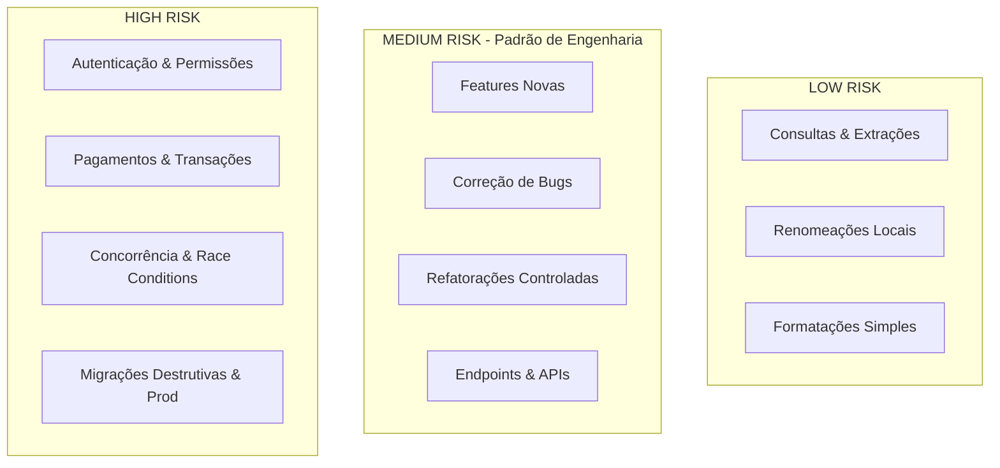

# Diretrizes: O Risk Dial

O **Risk Dial** é o mecanismo de controle de esforço e sobrecarga do *CLEARER Engineering Harness*. Em vez de aplicar uma sobrecarga pesada universal a todas as tarefas, o Risk Dial calibra o rigor com base no **custo de um erro**.

---

## Níveis do Risk Dial

---

## 1. Nível LOW (Baixo Risco)

### Quando Utilizar:
- Consultas a documentações ou arquivos.
- Extrações de pequenos trechos ou explicações de código.
- Renomeação de variáveis locais ou pequenas correções de digitação.
- Formatação ou adição de comentários.

### Características e Procedimento:
- Contexto enxuto.
- Execução direta e rápida.
- Nenhuma divisão pesada em subagentes.
- Inspeção básica do arquivo e validação do diff local.

---

## 2. Nível MEDIUM (Médio Risco — Padrão de Engenharia)

### Quando Utilizar:
- Desenvolvimento de novas funcionalidades (*features*).
- Correção de bugs funcionais (*bugfixes*).
- Refatorações de módulos ou serviços.
- Criação ou modificação de rotas de API, regras de negócio ou controllers.
- Alterações em models e schemas não-destrutivos.

### Procedimento Obrigatório:
1. **Inspeção Prévia**: Leitura do código existente e testes correspondentes.
2. **Plano de Implementação Conciso**: Arquivos tocados, mudanças propostas, contratos preservados e estratégia de teste.
3. **Implementação Cirúrgica**: Aplicação com blast radius mínimo.
4. **Execução de Testes**: Disparo do runner real de testes com captura do exit code.
5. **Auditoria de Diff**: Verificação de whitespace, conflitos e arquivos tocados com `scripts/diff-audit.sh`.
6. **Relatório de Evidências**: Emissão do Response Contract.

---

## 3. Nível HIGH (Alto Risco)

### Quando Utilizar:
- Módulos de autenticação, JWT, OAuth, sessões e autorização (RBAC/ABAC).
- Processamento financeiro, gateways de pagamento, cobranças e checkout.
- Concorrência, deadlocks, race conditions e filas assíncronas.
- Migrações de banco destrutivas (remoção/renomeação de colunas, alteração de tipos, drops).
- Código destinado diretamente a infraestrutura crítica ou produção.
- Bugs intermitentes ou com alto blast radius.

### Procedimento Obrigatório:
1. **Investigação Profunda (ceh-investigator)**: Mapeamento de dependências cruzadas e compilação do Evidence Pack.
2. **Desenho Arquitetural (ceh-architect)**: Análise detalhada de blast radius, invariantes de segurança e edge cases (null, timeouts, rollback).
3. **Implementação Isolada (ceh-implementer)**: Edição restrita sem extrapolação de escopo.
4. **Engenharia de Qualidade (ceh-test-engineer)**: Criação de testes de regressão (Red/Green) e cobertura de borda.
5. **Revisão Adversarial Independente (ceh-reviewer)**: Postura agressiva em busca de falhas de segurança e regressões silenciosas.
6. **Auditoria Formal de Claims (ceh-evidence-auditor)**: Rejeição de qualquer afirmação sem prova documental executada.
